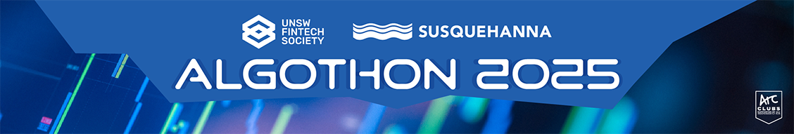

# 
Welcome to SIG x UNSW Financial Technology Society's 2021 Algothon.

---

[//]: # (For full documentation visit [mkdocs.org]&#40;https://www.mkdocs.org&#41;.)
Welcome to the third year of the Algothon - the first student-led algorithmic trading hackathon in Australia!

We're making this page available for you to gain access to our Algothon Guidelines, learning resources and technical advice, which will hopefully assist you in the competition. More information regarding the Algothon objectives, schedule and prizes will be made available in the lead-up to our competition start date.

## Case Brief
Fork, then clone the GitHub repository in the top right corner of the page. It contains the case brief, your evaluating program, price data and a base submission file to develop your algorithm!

## Register Now!

Register [here](https://forms.gle/k8epGyuM1iXJgZGf7) by: 

* 11:59 PM AEST 29 June for individuals.
* 11:59 PM AEST 6 July for teams.

Access the Facebook event [here](https://fb.me/e/2z2DANFce).

## Submissions
Submit your Algothon solution [here](https://forms.gle/uWHW5DN9kXS2xoFo9). 

Any competition feedback is welcome [here](https://forms.gle/X5tcWnrGauKxpBak7).

Contact us at *events@unswfintech.com* with '[2022 Algothon]' preceding your subject line, or message our Facebook page.